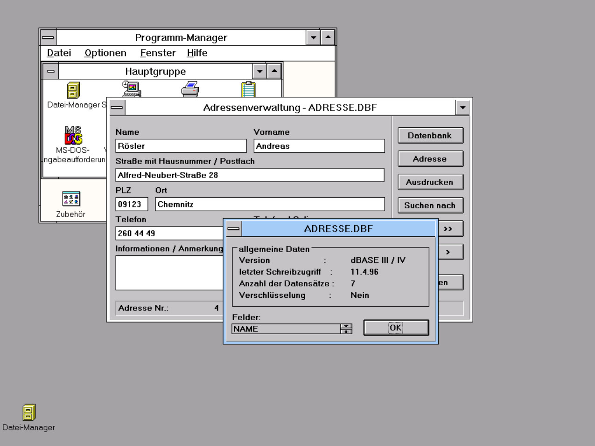
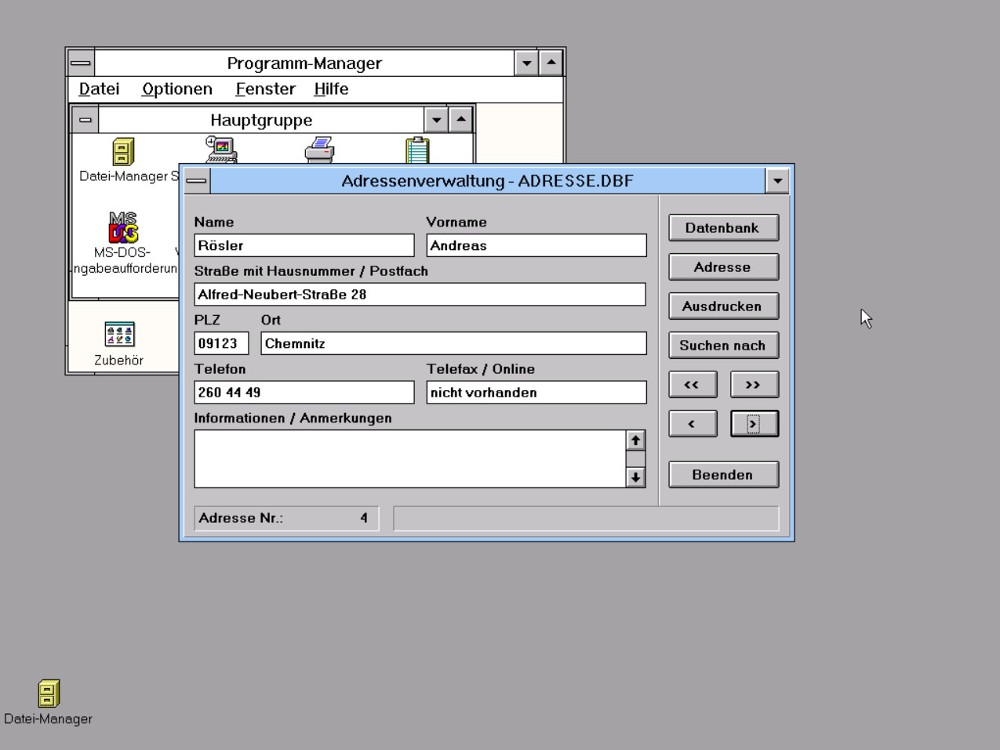
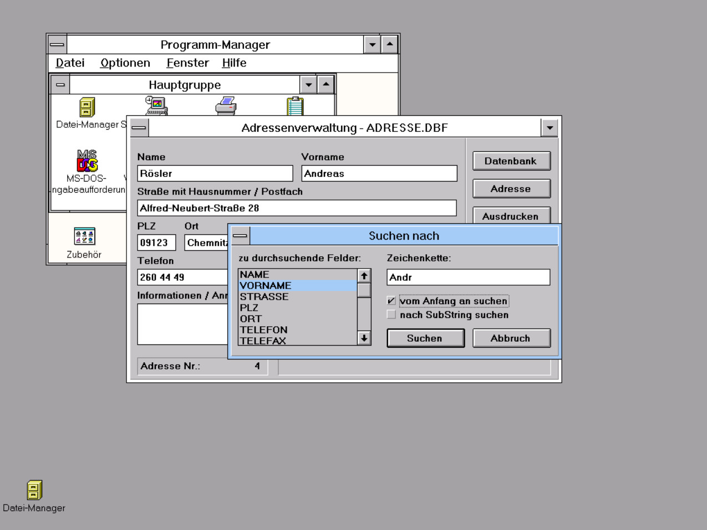
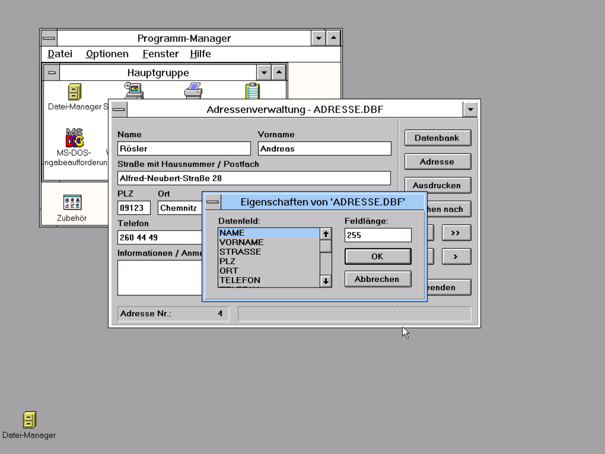
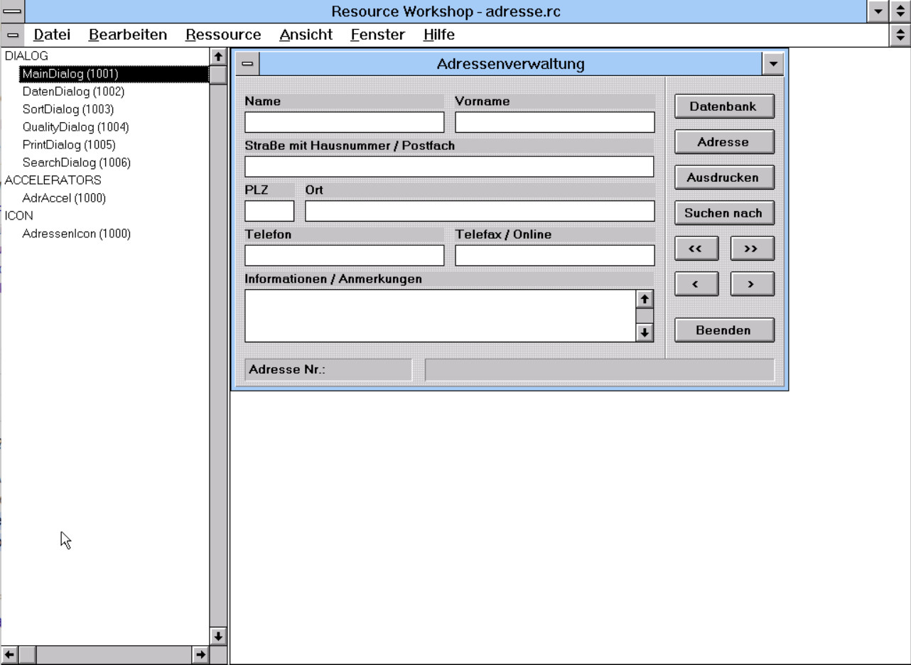
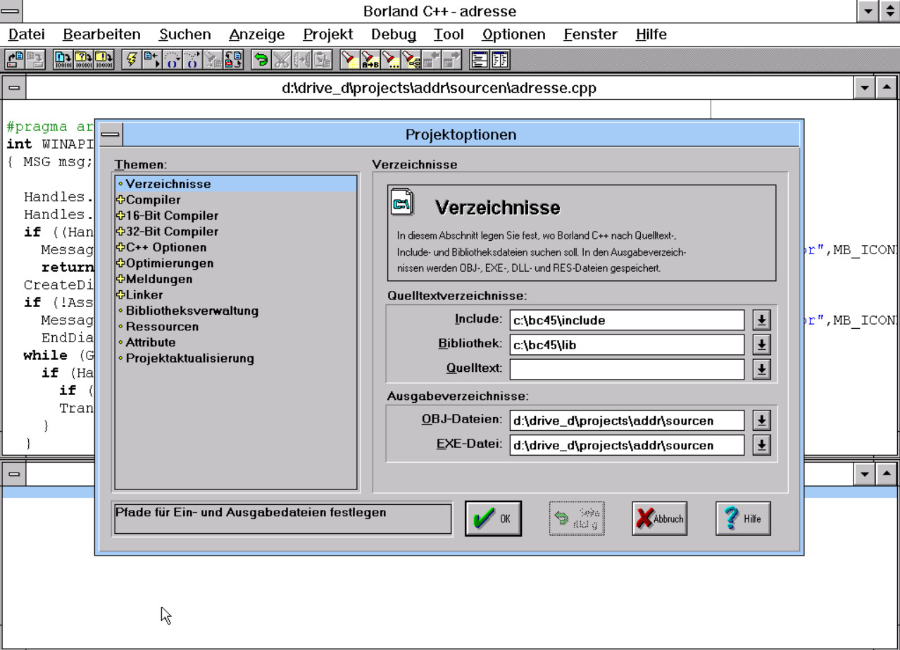

# 1996: My application as a part-time programmer

Like probably every other student, I wanted to earn my own money alongside school. And because I spent a lot of time programming anyway and was also allowed to work on a small project at university, a job as a programmer was an obvious choice. Spoiler: Nothing came of it :-).

At university I programmed in C under Linux. That seemed more exciting to me than the [Pascal stuff](https://github.com/aroesler-privat/historical-project_chemistry) I had been working on for the last few months. So I read up on programming in C under Windows on the side. Just to mention it: YouTube hadn't been invented yet, I had to take the bus to university for the internet and the most useful information was available in books I borrowed from the library. Sounds almost prehistoric from today's perspective. 

> [!NOTE]
> Untouched since 1996-04-11 ... Pay attention to the date of the last write access!

</img> </img> </img> </img> </img> 

# Run it

Obviously you need a compatible version of Windows to run this great address manager. In this case, the limit is probably a version that can handle 16-bit. It still worked in Windows 7 :-). However, Windows 3.1x is the most recommended version for an appropriate retro feeling.